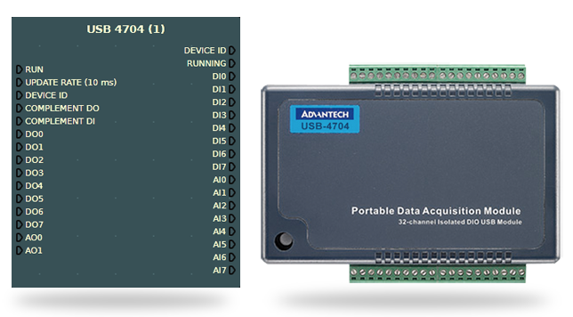

# USB4707-Csharp

  
*Image of the USB4704 module*

This repository contains a Visual Studio C# project designed to facilitate reading and writing digital inputs and outputs on the USB4704 module, commonly used in industrial applications. This project was created due to the lack of available information or support online regarding the use of libraries for this device. The goal is to provide a basic yet functional approach to working with the USB4704 module from a PC.

## ✨ Features

- **🟢 Digital Input/Output**: This project currently supports digital read and write operations on the USB4704 module.
- **🔧 Basic and Functional**: Aimed at giving users a straightforward way to interact with the USB4704.
- **🚀 Future Expansion**: Analog input/output functionality is not yet implemented, but contributions are welcome.

## 📋 Prerequisites

Before you can use this project, make sure you have the following installed:

1. **Navigator Program**: Install this software to ensure that the drivers for the USB4704 module are correctly installed on your PC, allowing it to be recognized.
2. **Automation.BDaq4.dll**: Add this DLL as a reference in your Visual Studio project to use the functionalities provided by the module.

> ⚠️ **Important Note**: Ensure that you download the Navigator program or DAQNavi from secure sources, such as the [official Advantech website](https://www.advantech.com/), to avoid security issues.

## 🛠️ Installation

1. **Clone this repository** to your local machine.
2. **Open the project** in Visual Studio.
3. **Install the Navigator program** to get the correct drivers.
4. In Visual Studio, **add a reference** to `Automation.BDaq4.dll` in your project.
5. **Build the project**.

## 🚀 Usage

Once the project is set up and the USB4704 module is connected to your PC, you can perform digital read and write operations through the provided methods in the project.

**Considering**: adding GIFs that show how to perform read and write operations in the interface, or screenshots of key steps in Visual Studio.

## 📈 Future Improvements

- **🔄 Analog Input/Output**: The project currently does not support analog operations. Future development or contributions in this area are highly encouraged.
- **💬 Community Feedback**: If you have suggestions for improvements or additional features, please share them. Your feedback is invaluable for future users.

## 🤝 Contributing

Contributions are welcome! If you have any improvements, bug fixes, or new features that could benefit others, feel free to create a pull request or open an issue.

## 📜 License

This project is open-source and available under the MIT License.
